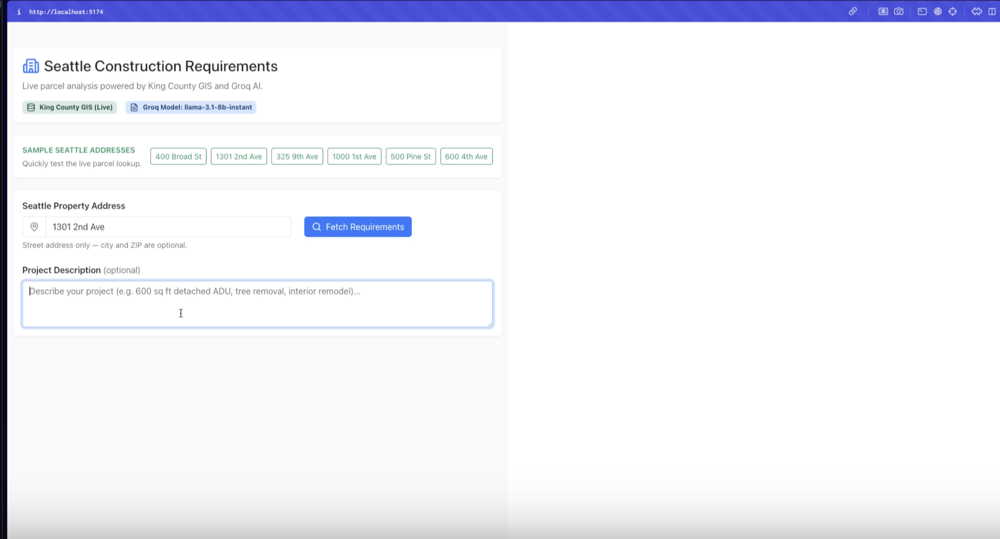

# PreAssess: Seattle Municipal Code Checker

[](https://www.loom.com/share/d4af27ac8770436d9edee1bc32035834?sid=6d392f9e-9d8e-4652-ae2b-bf69d861f378 "Watch the demo on Loom")

PreAssess turns Seattle’s municipal code into a plain-language checklist so residents know what the City expects before they remodel, plant, or build.

## What you get
- Plain-language front-end checklist with inline citations to the Seattle Municipal Code.
- Automated data pipeline that extracts Titles 22 and 23 from the latest PDF supplement.
- Retrieval-augmented Groq agent that drafts property reports backed by verified code snippets.

## Quick start

### Prerequisites
- Node.js 18 or newer (for the Vite app) and npm.
- Python 3.10+ with `pip`.
- Groq API key (only required for the AI report agent).

### Run the checklist app
1. Clone the repository and move into the project:
   ```bash
   git clone <your-fork-or-this-repo>
   cd seattle-checker
   ```
2. Install JavaScript dependencies:
   ```bash
   npm install
   ```
3. Start the development server:
   ```bash
   npm run dev
   ```
4. Open the printed localhost URL in your browser and walk through the checklist for any Seattle address.

### Refresh the municipal code data (optional)
1. Ensure Python dependencies are available (feel free to use a virtual environment):
   ```bash
   python3 -m venv .venv
   source .venv/bin/activate
   pip install PyPDF2 numpy torch transformers
   ```
2. Download the latest Seattle Municipal Code supplement PDF.
3. From the `seattle-checker` directory, run the helper script (it defaults to Titles 22 and 23):
   ```bash
   chmod +x data_processing/run_pipeline.sh
   ./data_processing/run_pipeline.sh /path/to/MunicipalCode.pdf
   ```
   The script creates or updates:
   - `data/title22.json` and `data/title23.json`
   - `data/processed/smc_chunks.jsonl`
   - `data/processed/smc_ground_truth.db`
   - `data/processed/smc_embeddings.npz`

### Generate an AI report (optional)
1. Export your Groq key and make sure Python can find the project code:
   ```bash
   export GROQ_API_KEY=your_api_key_here
   export PYTHONPATH="$(pwd)"
   ```
2. Run the sample agent to produce a mock property report backed by retrieved code snippets:
   ```bash
   python -m smc_agents.report_agent
   ```
   Tweak `smc_agents/report_agent.py` to change the questions or integrate the agent into your own workflow.

## How it works (under the hood)
1. **Upload** the latest municipal code PDF.
2. **Extract** the chapters of interest (Titles 22 & 23) into structured JSON.
3. **Chunk & embed** each section so the retriever searches targeted snippets instead of entire chapters.
4. **Retrieve & compose** the right passages when someone asks about their address, letting the Groq-powered agent write a report with citations.

## Repository tour
- `src/` – React + Vite front-end for the checklist experience.
- `data_processing/` – Scripts that parse the PDF, build ground-truth chunks, and generate embeddings.
- `smc_agents/` – Retrieval logic and Groq agent for producing narrative reports.
- `data/processed/` – Outputs generated by the data pipeline (JSONL, SQLite, embeddings).
- `docs/` – Supporting docs and demo assets (`loom-thumb.png`).

Need more detail on the extraction process? Check `docs/ground_truth.md` for an end-to-end walkthrough of the data pipeline.
