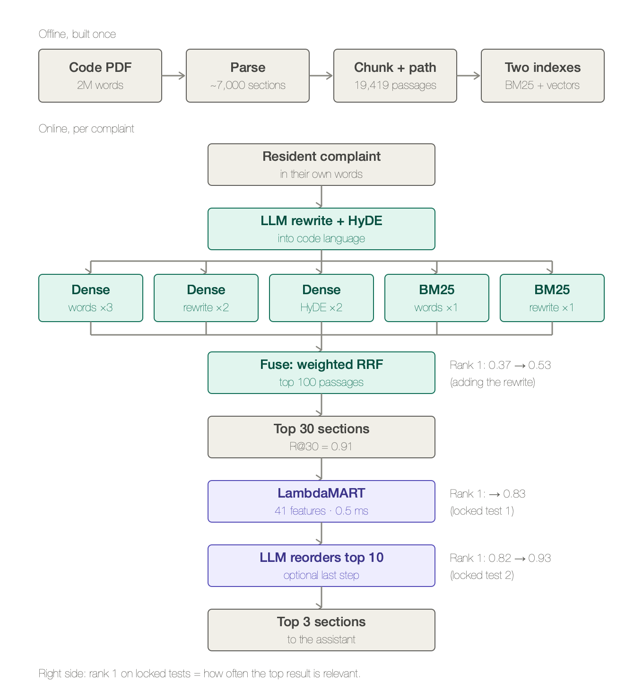
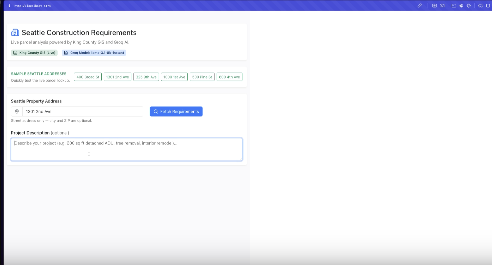

# PreAssess

Search over the Seattle Municipal Code. A resident describes a problem in their own
words ("my neighbour runs a car repair shop in his driveway") and PreAssess finds the
sections of the code that govern it. A companion app adds parcel context and drafts a
plain-language report whose citations are checked against the code.

Started at PACT-Athon 2025 (City of Seattle + AI House) with a five-person team
(3rd place). The search and ranking work and its evaluation came afterwards.

- [Search and ranking](#search-and-ranking): `search/`
- [The app](#the-app): `api/`, `src/`, `smc_agents/`
- [Data](#data): `data_processing/`, `data/`

---

## Search and ranking



### How it works

**Offline (once per code supplement).** The code PDF (21 titles, ~2M words) is parsed
into sections and cut into 19,419 chunks of up to ~900 characters. Each chunk is
indexed twice, with its title/chapter/section path prepended:

- a keyword index: SQLite FTS5 with three fields (chapter path, section heading, body),
  BM25 with field weights 2 / 5 / 1;
- a vector index: a MiniLM bi-encoder (mean pooling, L2-normalized), searched exactly.

**Per complaint:**

1. **Query understanding.** An LLM writes a rewrite in the code's vocabulary, a
   hypothetical passage (HyDE), and one short query per facet (rule, definition,
   penalty, enforcement, exceptions). It sees only the complaint.
2. **Five retrieval lists**, top 100 chunks each: dense on the complaint ×3, on the
   rewrite ×2, on the hypothetical passage ×2; BM25 on the complaint ×1 and on the
   rewrite ×1 (the multipliers are the fusion weights).
3. **Weighted reciprocal rank fusion** (k = 60) → top 100 chunks → each section takes
   its best chunk → **top 30 sections**.
4. **LambdaMART** (LightGBM lambdarank) reorders the 30 using 41 features per section:
   the section's rank and similarity in each list, agreement across lists, section
   size, smoothed popularity and category priors, word overlap, and facet matches.
5. **Optional:** an LLM reorders the ranker's top 10.

Every setting is in [`search/config.py`](search/config.py).

### How it's evaluated

- **Queries:** real resident complaints from the City's open data (*Code Complaints
  and Violations*), with addresses and contact details removed and multi-issue
  complaints split into issues.
- **Splits:** a dev set of 300 complaints that cite a section (the citation is removed
  from the text), a silver set of 400, and three locked test sets of 300 uncited
  complaints. Each test set was scored once.
- **Labels:** an LLM judge grades the pooled top results of every system 0-3, blind
  to which system produced them; relevant = 2 or 3. Claude Opus grades the silver and
  test sets (Claude Sonnet the dev set). Agreement on relevant/not: κ 0.95 for Opus
  re-grading itself, 0.80 with Sonnet, 0.74 with Gemma (a different model family).
  The judge has not yet been audited by people.
- **Metrics:** rank 1 (is the top section relevant), P@3, hit@3, nDCG@3. Comparisons
  are paired on the same complaints with bootstrap 95% intervals.

### Results (locked tests)

Test v2: 300 complaints, 278 with at least one relevant section found.

| System | rank 1 | P@3 | nDCG@3 |
|---|---|---|---|
| First stage, complaint words only (no LLM) | 0.37 | 0.28 | 0.46 |
| First stage with the LLM rewrite and HyDE | 0.53 | 0.41 | 0.64 |
| + LambdaMART (ranks, similarities, section features) | 0.77 | 0.56 | 0.80 |
| + popularity and category priors, word overlap, facets | **0.83** | **0.64** | **0.85** |

Test v3: a different 300 complaints, 262 answerable.

| System | rank 1 | P@3 | hit@3 | nDCG@3 |
|---|---|---|---|---|
| First stage with the LLM rewrite and HyDE | 0.50 | 0.39 | 0.76 | 0.62 |
| LambdaMART | 0.82 | 0.64 | 0.93 | 0.84 |
| LambdaMART, then the LLM reorders its top 10 | **0.93** | **0.76** | **0.99** | **0.95** |

The two tables use different complaints, so compare rows within a table only. Every
step above is significant on its test (paired bootstrap 95% intervals exclude zero),
e.g. the LLM rewrite +0.155 [+0.101, +0.209] and LambdaMART +0.248 [+0.183, +0.309]
rank 1 on test v2, and the LLM reorder +0.115 [+0.073, +0.160] on test v3.

**Without an LLM API** (test v2): the ranker on complaint-words features reaches 0.59
rank 1; with a small local rewriter (flan-t5, distilled from the LLM's rewrites)
0.75.

**Cost and speed:** LambdaMART scores 30 candidates in ~0.5 ms on a laptop CPU (a
568M-parameter cross-encoder took ~1.7 s for the same candidates and ranked worse on
dev). The LLM calls were not benchmarked.

### Limitations

- Evaluated offline only; there is no click data or A/B test.
- Labels come from an LLM judge checked by agreement, not by human review.
- The evaluated model's popularity prior counted each training complaint's own
  label. Leave-one-out priors (`Priors.features(..., exclude=own_labels)`) fixed
  that in cross-validation and helped rare issues (rank 1 0.18 → 0.33) but were not
  used in the locked-test runs.
- About 3% of chunk ids repeat in the extracted data; later records overwrite
  earlier ones.
- The fine-tuned encoder and the evaluation data are not included. The defaults use
  the public `all-MiniLM-L6-v2`.

### Using it

```bash
pip install -r requirements.txt lightgbm
python -m search build                                   # keyword index + chunk vectors (a few minutes on CPU)
python -m search query "my neighbour's dog barks all night"
```

```python
from search.pipeline import Searcher
from search import ranker, cascade

s = Searcher.open()
res = s.search(complaint, llm=my_llm)        # my_llm: prompt -> text; omit for the no-LLM tier
res.candidates                               # 30 sections, first-stage order
res.X                                        # 41 features per candidate
```

`search.ranker` trains and applies LambdaMART on graded complaints;
`search.cascade.reorder` applies the LLM reorder. On macOS, run PyTorch and LightGBM in
separate processes (they ship different OpenMP runtimes); `python -m search query
--ranker` does this.

This package is a consolidated version of the research code behind the numbers above.
On the test v3 complaints it reproduces that code's candidates and features exactly
(cosines to 1e-6) and, given the same training data, the same LambdaMART rankings for
all 300 complaints.

| Module | Step |
|---|---|
| `search/corpus.py` | chunks, sections, breadcrumb text |
| `search/lexical.py` | FTS5 fielded index, BM25 |
| `search/dense.py` | bi-encoder, exact vector search |
| `search/query.py` | LLM rewrite, hypothetical passage, facet queries |
| `search/first_stage.py` | five lists, weighted RRF, top 30 sections |
| `search/features.py` | the 41 features, smoothed priors |
| `search/ranker.py` | LambdaMART training and ranking |
| `search/cascade.py` | optional LLM reorder of the top 10 |
| `search/metrics.py` | rank 1, P@k, hit@k, nDCG@k, paired bootstrap |

---

## The app

Enter a Seattle address and a project ("add a 600 sq ft detached ADU"). PreAssess
pulls the parcel from King County GIS, resolves the overlay districts,
environmentally critical areas and street trees that apply from the City's GIS
layers (shown on a parcel map), retrieves the governing code sections, drafts a
plain-language report, and then **audits every SMC citation in the report against
the code that was actually retrieved**. Citations render green (verified in
evidence), yellow (exists in the code but wasn't shown to the model), or red (not
found). Click any citation to read the code text.

[](https://www.loom.com/share/d4af27ac8770436d9edee1bc32035834?sid=6d392f9e-9d8e-4652-ae2b-bf69d861f378 "Watch the demo on Loom")

### Why the verification layer exists

Legal-information RAG has a specific failure mode: the model writes a confident
requirement with a plausible-looking citation that doesn't exist. Asking the model to
cite is not a guarantee; checking the citations is.

```
citation audit for a generated report:
  23.42.022  -> grounded                    (matches retrieved evidence)
  22.801     -> in_corpus_not_retrieved     (real code, but not shown to the model)
  99.99.999  -> unknown                     (appears nowhere in the ingested code)
grounded_ratio: 0.33
```

In a field test, the same model answering the same resident questions cited
non-existent SMC sections 33% of the time without this pipeline and 0% with it (92%
verified against retrieved evidence): [docs/FIELD_TEST.md](./docs/FIELD_TEST.md),
`eval/citation_reliability.py`.

### Architecture

```
                    browser (React + Vite + Leaflet parcel map)
                      │ address + project              citations clicked
                      ▼                                ▼
 King County GIS ◄─ /api/parcel/query    /api/report  │  /api/citation
 Seattle GIS     ◄─ /api/context             │        │
 (zoning, overlays,      │                   ▼        ▼
  ECA, street trees)     └──► overlay chapters as evidence requests
                                             │
                       FastAPI  ──►  GroundedRetriever ──► LLM (server-side key,
                                     dense + BM25, RRF      any OpenAI-compatible
                                     19,419 SMC chunks      endpoint; Groq default)
                                     (21 titles)                │
                                                                ▼
                                                          citation_check
                                                          audits the report
```

The app's retriever (`smc_agents/retriever.py`) is the earlier hybrid design: dense +
BM25 fused with RRF, plus a cross-encoder reranker (`PREASSESS_RERANK=1`; on by default in
`docker-compose.yml`). The `search/` pipeline above is
the evaluated successor.

### Early retrieval evaluation

39 hand-labeled resident-style queries (`eval/queries.jsonl`, `python -m
eval.retrieval_eval`). Here "recall@k" is the share of queries with a labeled section
in the top k (a hit rate):

| config | recall@1 | recall@3 | recall@5 | MRR@5 |
|--------|----------|----------|----------|-------|
| dense | 0.28 | 0.54 | 0.62 | 0.42 |
| fts (BM25) | 0.03 | 0.15 | 0.23 | 0.09 |
| prefilter (old design) | 0.23 | 0.51 | 0.56 | 0.37 |
| rrf-fused | 0.36 | 0.51 | 0.64 | 0.46 |
| rrf + cross-encoder | 0.59 | 0.64 | 0.64 | 0.61 |

On the 2-title corpus BM25 alone scored 0.31 recall@1; on the 21-title corpus it fell
to 0.03, because common permit words match across the whole code. This harness also
caught the original hybrid mode returning an arbitrary candidate subset (a missing
`ORDER BY` before `LIMIT`). `eval/results.md` has the details. With only 39 queries
these numbers carry wide intervals, which is why the evaluation above uses real
complaints and locked test sets.

### Quickstart

Prerequisites: Python 3.11+, Node 20+, and optionally a Groq API key (retrieval and
the checklist work without one; report generation needs it).

```bash
# API (from the repo root; corpus artifacts are committed)
pip install -r requirements-dev.txt
python -m pytest tests/ -q          # offline, no keys needed
GROQ_API_KEY=... uvicorn api.main:app --port 8000

# Frontend (dev)
npm ci
npm run dev                          # Vite proxies /api to :8000
```

Or as one container:

```bash
GROQ_API_KEY=... docker compose up --build   # serves app + API on :8000
```

### API

| Endpoint | What |
|----------|------|
| `POST /api/report` | Property + project → report, citation audit, grounded ratio, evidence (rate-limited) |
| `GET /api/search?q=` | Fused retrieval over the corpus |
| `GET /api/citation/{smc}` | Exact code text for a citation (section, subsection, or chapter) |
| `GET /api/context` | Zoning, overlay districts, ECA flags, street trees at a point (Seattle GIS) |
| `GET /api/parcel/query` | King County GIS proxy (fixed upstream) |
| `GET /api/health`, `GET /api/stats` | Corpus + config introspection |

### App limitations

- **21 of the SMC's titles are ingested** (the PDF yielded nothing usable for Titles
  12, 13 and 19). Citations into missing titles are reported as "not found in the
  ingested code" rather than guessed at.
- **Not legal advice.** The report is a research aid over the code text; permits are
  decided by the City, not a model.
- **grounded_ratio measures citation discipline, not correctness:** a report can cite
  real, retrieved code and still reason about it imperfectly.

---

## Data

`data_processing/` extracts the code from the City's PDF supplement and builds the
chunk file, the SQLite index and the embeddings in `data/processed/` (committed, so the
app runs after cloning). Rebuild from a new supplement with
`./data_processing/run_pipeline.sh /path/to/MunicipalCode.pdf`, then
`python -m search build`.

## License

MIT
