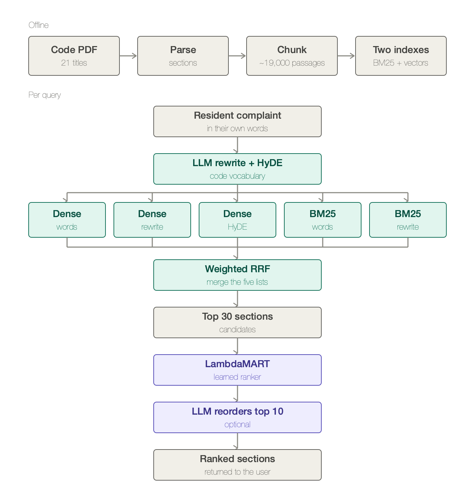

# PreAssess

Search over the Seattle Municipal Code. A resident describes a problem in their own
words ("my neighbour runs a car repair shop in his driveway") and PreAssess finds the
sections of the code that govern it. A companion app adds parcel context and drafts a
plain-language report whose citations are checked against the code.

Started at PACT-Athon 2025 (City of Seattle + AI House) with a five-person team
(3rd place).

- [Search and ranking](#search-and-ranking): `search/`
- [The app](#the-app): `api/`, `src/`, `smc_agents/`
- [Data](#data): `data_processing/`, `data/`

---

## Search and ranking



**Offline.** The code (21 titles) is split into sections and ~19,000 short passages.
Each passage is indexed for keyword search (SQLite FTS5, BM25 over the chapter,
heading and body) and for vector search (a MiniLM bi-encoder).

**Per query:**

1. An LLM rewrites the complaint in the code's vocabulary and writes a short
   hypothetical code passage (HyDE).
2. Five searches run over the original wording, the rewrite and the hypothetical
   passage, and are merged with weighted reciprocal rank fusion.
3. The top 30 sections are reordered by a LambdaMART model (LightGBM).
4. Optionally, an LLM reorders the top 10.

All settings are in [`search/config.py`](search/config.py).

### Evaluation

Queries are real resident complaints from the City's open data. Relevance was graded
0–3 by an LLM judge, blind to which system produced each result. Results below are on
held-out test sets of 300 complaints that were used once.

| System | Top result relevant | nDCG@3 |
|---|---|---|
| Keyword + vector search | 0.37 | 0.46 |
| + LLM query rewriting | 0.53 | 0.64 |
| + LambdaMART | 0.83 | 0.85 |

On a second held-out set, adding the LLM reordering of the top 10 raised the top
result from 0.82 to 0.93. Each step is significant (paired bootstrap, 95%). Ranking
30 candidates takes about half a millisecond on a laptop CPU.

Evaluation is offline only, and the evaluation data and fine-tuned encoder are not
included in this repository.

### Usage

```bash
pip install -r requirements.txt lightgbm
python -m search build                                   # build the indexes (a few minutes on CPU)
python -m search query "my neighbour's dog barks all night"
```

```python
from search.pipeline import Searcher

s = Searcher.open()
res = s.search(complaint, llm=my_llm)   # my_llm: prompt -> text; omit to search without an LLM
res.candidates                          # top 30 sections
res.X                                   # ranker features for each
```

`search.ranker` trains and applies the ranker; `search.cascade` applies the LLM
reordering.

---

## The app

Enter a Seattle address and a project ("add a 600 sq ft detached ADU"). PreAssess
pulls the parcel from King County GIS, resolves the overlay districts,
environmentally critical areas and street trees that apply from the City's GIS
layers (shown on a parcel map), retrieves the relevant code sections, drafts a
plain-language report, and checks every SMC citation in the report against the code
that was retrieved. Citations render green (verified in evidence), yellow (exists in
the code but wasn't shown to the model), or red (not found). Click any citation to
read the code text.

[](https://www.loom.com/share/d4af27ac8770436d9edee1bc32035834?sid=6d392f9e-9d8e-4652-ae2b-bf69d861f378 "Watch the demo on Loom")

```
citation audit for a generated report:
  23.42.022  -> grounded                    (matches retrieved evidence)
  22.801     -> in_corpus_not_retrieved     (real code, but not shown to the model)
  99.99.999  -> unknown                     (appears nowhere in the ingested code)
grounded_ratio: 0.33
```

### Architecture

```
                    browser (React + Vite + Leaflet parcel map)
                      │ address + project              citations clicked
                      ▼                                ▼
 King County GIS ◄─ /api/parcel/query    /api/report  │  /api/citation
 Seattle GIS     ◄─ /api/context             │        │
 (zoning, overlays,      │                   ▼        ▼
  ECA, street trees)     └──► overlay chapters as evidence requests
                                             │
                       FastAPI  ──►  GroundedRetriever ──► LLM (server-side key,
                                     dense + BM25, RRF      any OpenAI-compatible
                                     19,419 SMC chunks      endpoint; Groq default)
                                     (21 titles)                │
                                                                ▼
                                                          citation_check
                                                          audits the report
```

### Quickstart

Prerequisites: Python 3.11+, Node 20+, and optionally a Groq API key (retrieval and
the checklist work without one; report generation needs it).

```bash
# API (from the repo root; corpus artifacts are committed)
pip install -r requirements-dev.txt
python -m pytest tests/ -q          # offline, no keys needed
GROQ_API_KEY=... uvicorn api.main:app --port 8000

# Frontend (dev)
npm ci
npm run dev                          # Vite proxies /api to :8000
```

Or as one container:

```bash
GROQ_API_KEY=... docker compose up --build   # serves app + API on :8000
```

### API

| Endpoint | What |
|----------|------|
| `POST /api/report` | Property + project → report, citation audit, grounded ratio, evidence (rate-limited) |
| `GET /api/search?q=` | Retrieval over the corpus |
| `GET /api/citation/{smc}` | Exact code text for a citation (section, subsection, or chapter) |
| `GET /api/context` | Zoning, overlay districts, ECA flags, street trees at a point (Seattle GIS) |
| `GET /api/parcel/query` | King County GIS proxy (fixed upstream) |
| `GET /api/health`, `GET /api/stats` | Corpus + config introspection |

### Notes

- 21 of the SMC's titles are ingested (the PDF yielded nothing usable for Titles 12,
  13 and 19). Citations into missing titles are reported as not found rather than
  guessed at.
- Not legal advice. The report is a research aid over the code text; permits are
  decided by the City.

---

## Data

`data_processing/` extracts the code from the City's PDF supplement and builds the
files in `data/processed/` (committed, so the app runs after cloning). To rebuild from
a new supplement: `./data_processing/run_pipeline.sh /path/to/MunicipalCode.pdf`, then
`python -m search build`.

## License

MIT
